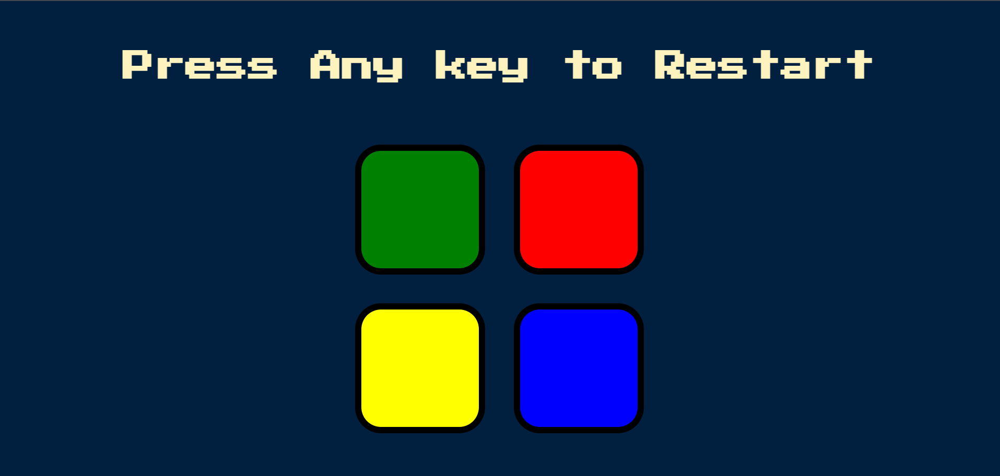
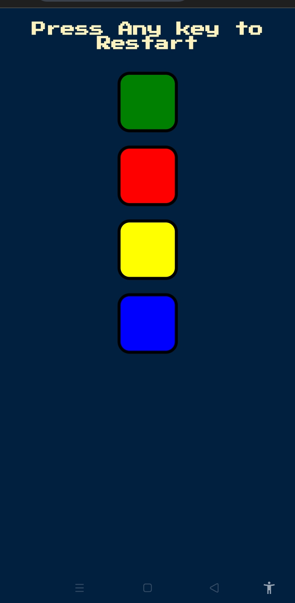
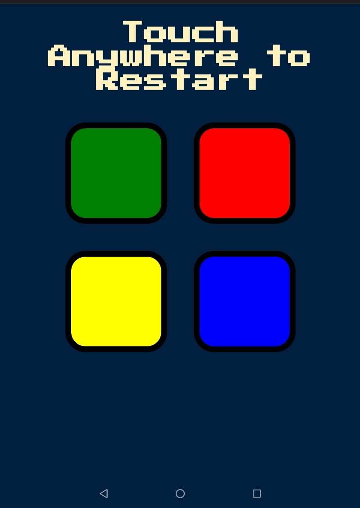

# Simon Game 🎮

A fun and interactive Simon Game built using **HTML, CSS, JavaScript, and jQuery**.  
Users must follow the pattern of colors generated by the game to progress through levels.  

## 🚀 Features
- Randomized color sequences 🎨
- Click/touch-based input support for mobile & desktop 📱💻
- Game over animations and sounds 🔊
- Responsive design for different screen sizes 📏

## 🛠️ Technologies Used
- HTML5
- CSS3
- JavaScript (ES6)
- jQuery

## 📷 Screenshots

 
 

## 📌 How to Play?
1. Press any **key** (on desktop) or **tap** (on mobile) to start the game.
2. Memorize the sequence of colors.
3. Click/tap the colors in the same order.
4. Each correct sequence moves you to the next level.
5. If you make a mistake, the game ends, and you can restart.

## 🖥️ How to Run Locally?
1. Clone the repository:
   ```bash
   git clone https://github.com/Mukesh469/Simon-Game-Js.git
